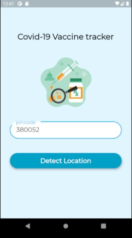
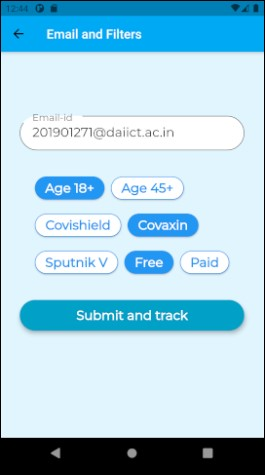
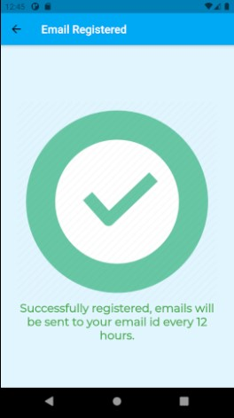
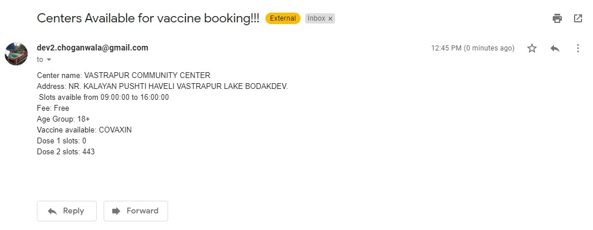

# Flutter based vaccine tracker

## Description
Flutter application used to track availability of vaccine based on user's pincode and send periodic emails. Backend built with flask, vaccine data collected by making API requests to CoWIN using python's request module.

## Tech Stack
   

## Project Screenshots
<table>
  <tr>
    <td>Home Page</td>
     <td>Filters and email id</td>
     <td>Final page</td>
  </tr>
  <tr>
    <td></td>
    <td></td>
    <td></td>
  </tr>
 </table>
 
Email sent after registering

